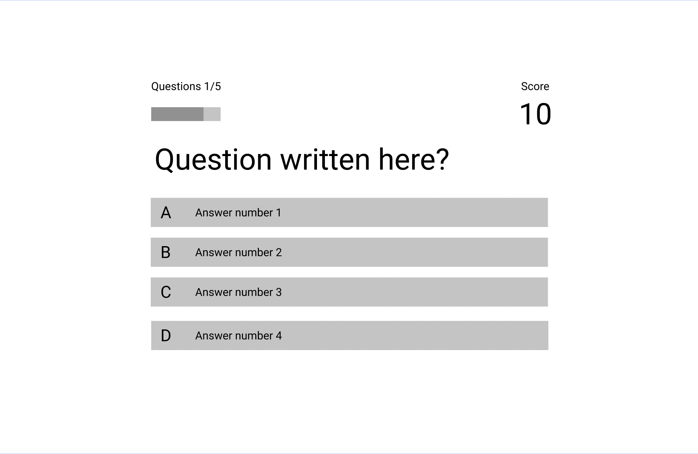

# Alex's Pub Quiz project

&nbsp;  

## Table of Contents
---

- [UX](#ux)
    - [Website owners goals](#website-owners-goals)
    - [Users goals](#users-goals)
    - [Wireframes](#wireframes)
    - [Website design elements](#website-design-elements)
        - [Colors](#colors)
        - [Fonts](#fonts)
        - [Images](#images)
- [Features](#features)
    - [Home page](#home-page)
    - [Game page](#game-page)
    - [End page](#end-page)
    - [Leaderboard page](#leaderboard-page)
- [Technologies used](#tecnologies-used)
- [Testing and Validation](#testing-and-validation)
    - [HTML and CSS](#html-and-css)
    - [Accessibility and Responsiveness](#accessibility-and-responsiveness)
    - [Compatibility](#compatibility)
    - [User stories testing](#user-stories-testing)
        - [Website owner](#website-owner)
        - [New visitor](#new-visitor)
        - [Returning visitor](#returning-visitor)
    - [Bugs](#bugs)
        - [From the Slack feedback request](#from-the-slack-feedback-request)
    - [Unfixed Bugs](#unfixed-bugs)
- [Deployment](#deployment)
- [Credits](#credits)

&nbsp;

## UX
---
### Website owners goals
Alex's Cinema Quiz it's a quick quiz to test your cinema knowledge and compete with friends. 
&nbsp;

### Users goals
This project is for educational purposes only. My goal is to build responsive website using JavScript.
&nbsp;

### Wireframes

&nbsp;

### Website design elements
#### Colors
The colours chosen for the project are:
* backfround color: #163246
* font color: #F5F5F5
* link and buttons background color: Gradient from #329d9c to #56c596
* link and buttons text color: #ffffff
&nbsp;

#### Fonts
The main font is the Roboto Serif, and as a backup font the standard browser serif.
&nbsp;

[Back to Table of contents](#table-of-contents)
&nbsp;  

## Features
---
### Home Page
The home page includes a welcome message and an easy selection to start the game or view the score leaderboard.

### Game Page
The game page has the following features:

* Showing Spinning loader to allow content of question and answer to load without showing only the empty page.

* Showing the user the Head's up display with amount of question needed to complete the game, progress bar to give feedback on current completion of the game and total score. This all update dynamically.

* User can hover and have an indication of witch answer is about to select with css animation.

* Immediate feedback with color style, on click of the mouse if answer is correct or not and automatically displaing the next question of the quiz.

* At completion of amount of questions requested user gets automatically directed to end page to save score and access to leaderboard.

* If the user wants to play the game again, there is a larger set of question available then just the 5 requested to win, to keep the game interesting and replayable.

### End Page
The End page is designed to show the total score of the current game and letting the user save their username and score. The save button only works if user first types in a valid username and not just a whitespace. The end page also saves the final score obtained in the game page once the actual game is finished, saving it in local storage, paired with the username chosen by the user.

### Leaderboard Page
The leaderboard page takes the scores saved in the local storage of the brownser and shows the Leaderboard with the scores sorted, then directs the user back to Play anothe game or to the Home page.
The local storage is not secured and will rely on the honesty of the user playing the game.
&nbsp;

[Back to Table of contents](#table-of-contents)
&nbsp;  

## Technologies used
---
- HTML as structure language
- CSS as style language
- JavaScript as dynamic functions language
- Font Awesome as and icon library for social links
- Google Fonts as font resource
- GitHub as software hosting platform to keep project in a remote location
- Git as version-control system tracking
- GitPod as developer hosting platform
- Figma as wireframing tool application
- GIMP (GNU Image Manipulation Program) as image editor
- [Open Trivia Database](https://opentdb.com/) for the questions of the quiz.
&nbsp;  

[Back to Table of contents](#table-of-contents)
&nbsp;  

## Testing and Validation
---
### HTML and CSS
The code of every page and the stylesheet has been tested with:
- W3C Markup Validation Service 
- W3C CSS Validation Service
- JavaScript validated with JSHint

The errors found have been corrected. Some warning are still present for the Empty tags that will be filled by JavaScript when the content is loaded.
&nbsp;  

### Accessibility and Responsiveness
The website has been tested with Chrome Deveoper Tools and Google Lighthouse to validate performance and accessibility ratings. The bugs and error were corrected.
&nbsp;  

### Compatibility
The website was tested using Chrome developer tools and Mozilla Developer tools.
The website was tested with Chrome, Mozilla, Safari and Edge browsers on both a Mac computer and a Windows computer; it was also tested for mobile on an iPhone 6, iPhone 11, iPhone 13 Pro, Pixel 4, Pixel 5 and Galaxy S10.
&nbsp;

### User stories testing
Users of this website will be able to play the game with their friends, test their knowledge about cinema and compete, reviewing their score in the leaderboard. Excellent quick game to support a pub quiz.
&nbsp;

#### Website owner
Offer the puclic a free game, easy to use to enjoy alone or with friends. 
&nbsp;

#### New visitor
Easy to navigate game with a minimalistic interface will allow new visitors to immediately jump into the game without having to read long instructions.
&nbsp;

#### Returning visitor
Returning visitors can enjoy a different set of questions when they play the game again. The question are selected from the Open Trivia API which allows the game to select from a pool of 50 easy questions about cinema.
&nbsp;

### Bugs
* Links from index.html files not recognised when deployed to GitHub. I had to remove the / for the root folder for the pages to link correctly in-between themselves.
* When deployed on GitHub, at the end page, when the user saves the username with their score GitHub returns a 404 error for the JavaScript file linked to it. This issue does not occur locally. It was resolved in the end.js file where the function called by the Save button would redirect to the root, instead of the index.html page.
&nbsp;

### Unfixed Bugs
None found at the moment.
&nbsp;

[Back to Table of contents](#table-of-contents)
&nbsp;  

## Deployment
---
---

The website was deployed using GitHub Pages. I have used Gitpod as a development environment and changes were committed to git version control system. With the push command from Gitpod I've saved regularly in GitHub my code.

Steps to deploy:
- Log in into GitHub and select the repository [GitHub repository](https://github.com/alessandracosta8/alex-pub-quiz-pp2) to deploy
- Navigate to the `Settings` tab 
- From the side menu select the `Pages` section
- Select the `main` branch and `save`

> The website was published

[The live link - https://alessandracosta8.github.io/alex-pub-quiz-pp2/](https://alessandracosta8.github.io/alex-pub-quiz-pp2/)

&nbsp;

To run locally:
- In the [GitHub repository](https://github.com/alessandracosta8/alex-pub-quiz-pp2)
- Select `Code` and select the dropdown menu, click Download the ZIP file
- after the download, extract the files and use it in your local environment

You are free to use this code, [Clone](https://docs.github.com/en/repositories/creating-and-managing-repositories/cloning-a-repository) or [Fork](https://docs.github.com/en/get-started/quickstart/fork-a-repo) this [GitHub repository](https://github.com/alessandracosta8/alex-pub-quiz-pp2) into your own github account.

&nbsp;  

[Back to Table of contents](#table-of-contents)
&nbsp;  

## Credits
---

CSS Transform properties - [Youtube](https://www.youtube.com/watch?v=rzD-cPhq02E)

CSS Animations - [Youtube](https://www.youtube.com/watch?v=YszONjKpgg4)

Traversing the DOM - [Youtube](https://www.youtube.com/watch?v=v7rSSy8CaYE)

Array.from function - [Youtube](https://www.youtube.com/watch?v=NPbDqbwtr-4)

Arrow functions - [Youtube](https://www.youtube.com/watch?v=h33Srr5J9nY)

Spread Operator [MDN Web Docs](https://developer.mozilla.org/en-US/docs/Web/JavaScript/Reference/Operators/Spread_syntax), [Youtube](https://www.youtube.com/watch?v=iLx4ma8ZqvQ)

.forEach Array method - [YouTube](https://www.youtube.com/watch?v=SXb5LN_opbA)

Callback functions - [YouTube](https://www.youtube.com/watch?v=670f71LTWpM)

JSON - [YouTube](https://www.youtube.com/watch?v=iiADhChRriM)

Fetch API - [YouTube](https://www.youtube.com/watch?v=cuEtnrL9-H0)

Promises - [YouTube](https://www.youtube.com/watch?v=DHvZLI7Db8E)

Build a loader W3 Schools - [Link](https://www.w3schools.com/howto/howto_css_loader.asp)

Build a quiz app with JavaScript tutorial - [YouTube playlist](https://www.youtube.com/playlist?list=PLDlWc9AfQBfZIkdVaOQXi1tizJeNJipEx)

Decoding HTML entities with vanilla JavaScript - [Link](https://gomakethings.com/decoding-html-entities-with-vanilla-javascript/)

&nbsp;